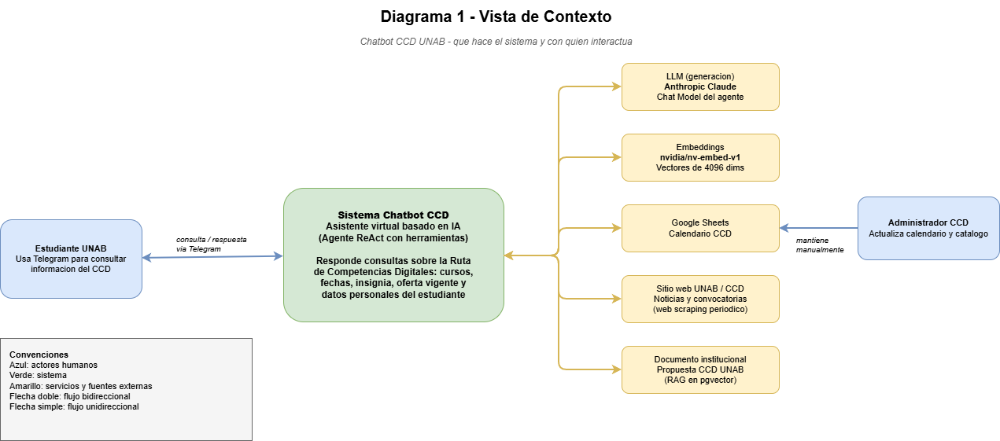
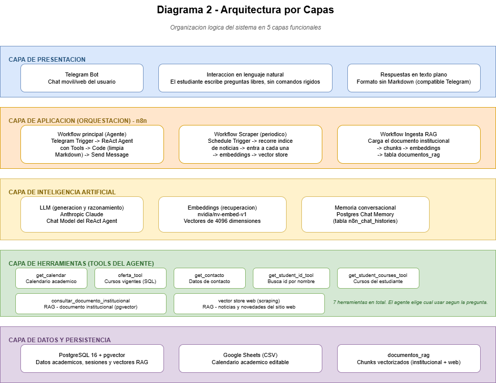
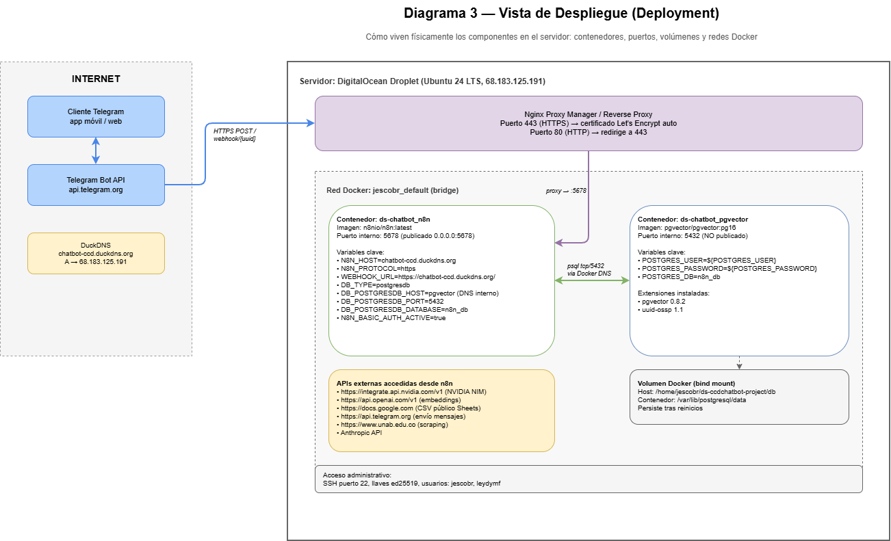
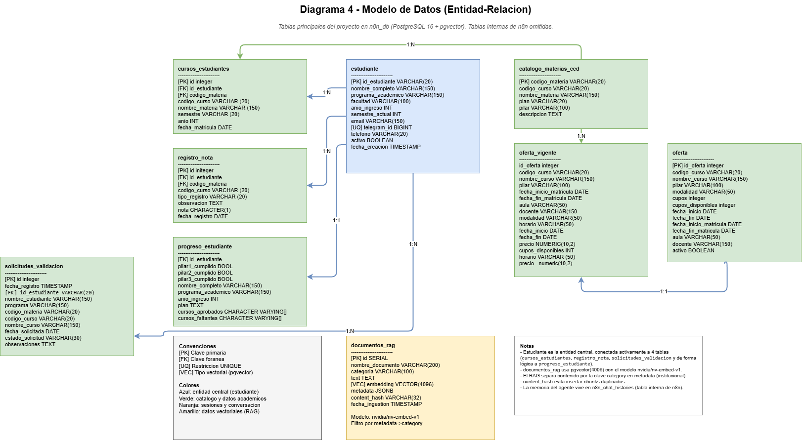
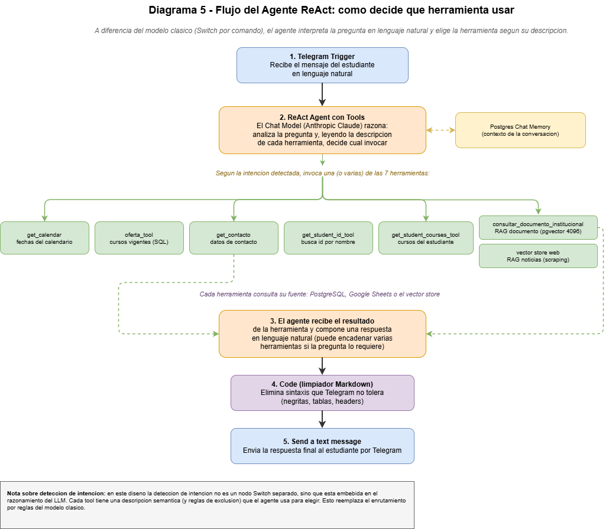
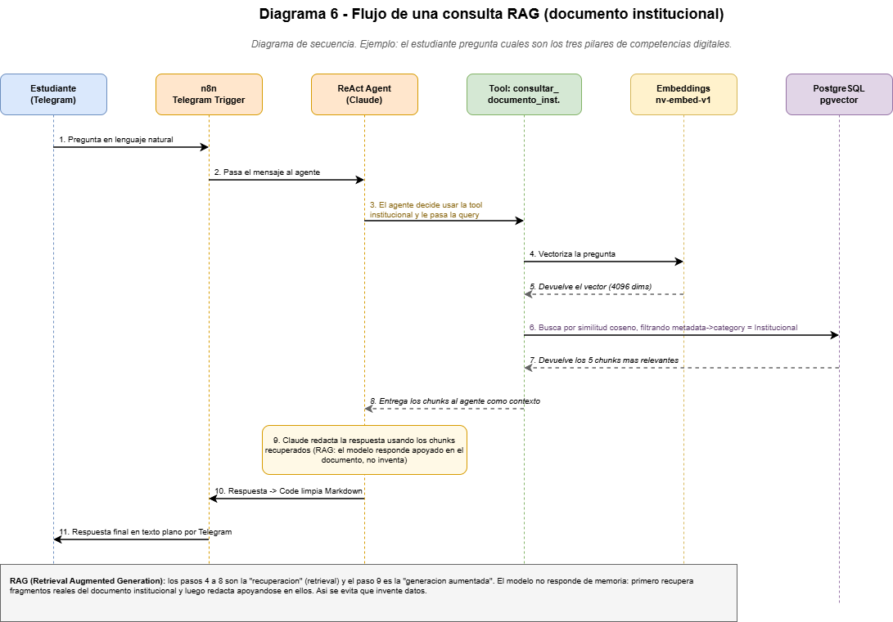

# Chatbot Inteligente para el Centro de Competencias Digitales (CCD - UNAB)

### Proyecto de Ciencia de Datos - Ingenieria de Sistemas - UNAB - Bucaramanga, Colombia

> Asistente virtual institucional basado en arquitectura RAG y un agente ReAct, que permite a los estudiantes de la UNAB consultar la Ruta de Competencias Digitales, la oferta de cursos, el calendario academico, su historial personal y el documento institucional del CCD, todo desde Telegram.


[](https://youtu.be/wruobD7kIc4)

---

## Tabla de contenidos

1. [Que hace este proyecto](#que-hace-este-proyecto)
2. [Arquitectura general](#arquitectura-general)
3. [Stack tecnologico](#stack-tecnologico)
4. [Estructura del repositorio](#estructura-del-repositorio)
5. [Requisitos previos](#requisitos-previos)
6. [Instalacion y despliegue desde cero](#instalacion-y-despliegue-desde-cero)
7. [Configuracion de la base de datos](#configuracion-de-la-base-de-datos)
8. [Importar los workflows en n8n](#importar-los-workflows-en-n8n)
9. [Los workflows del sistema](#los-workflows-del-sistema)
10. [Las herramientas del agente](#las-herramientas-del-agente)
11. [Sistema RAG](#sistema-rag)
12. [Uso del chatbot](#uso-del-chatbot)
13. [Conceptos clave](#conceptos-clave)
14. [Solucion de problemas frecuentes](#solucion-de-problemas-frecuentes)
15. [Limitaciones conocidas](#limitaciones-conocidas)
16. [Creditos](#creditos)

---

## Que hace este proyecto

El Chatbot CCD es un asistente virtual que responde, en lenguaje natural y a traves de Telegram, las preguntas mas frecuentes de los estudiantes sobre la Ruta de Competencias Digitales de la UNAB. En lugar de un menu rigido de comandos, usa un agente inteligente que interpreta la pregunta y decide por si mismo que fuente de informacion consultar.

| Funcionalidad | Como funciona | Ejemplo de pregunta |
| --- | --- | --- |
| Informacion institucional | RAG sobre el documento oficial del CCD | "Que son los tres pilares de competencias digitales" |
| Oferta de cursos vigente | Consulta SQL a la base de datos | "Que cursos hay este periodo y cuanto cuestan" |
| Calendario academico | Lectura de un Google Sheet | "Cuando es la prueba diagnostica" |
| Historial personal del estudiante | Consulta SQL con control de privacidad | "Que cursos del CCD he tomado" |
| Insignia de Competencias Digitales | RAG sobre el documento institucional | "Que ventajas tiene la insignia" |
| Noticias y novedades | Web scraping periodico del sitio de la UNAB (el scraping se ejecuta pero su contenido no persiste entre reinicios de n8n al usar Simple Vector Store en memoria) | "Hay nuevos cursos disponibles" |
| Contacto del CCD | Consulta directa | "Como contacto al CCD" |

---

## Arquitectura general

El sistema se organiza en cinco capas: presentacion (Telegram), orquestacion (n8n), inteligencia artificial (Claude + embeddings + memoria), herramientas del agente y datos (PostgreSQL, Google Sheets, vector store).

```
                         Estudiante (Telegram)
                                  |
                                  v
                         n8n - Telegram Trigger
                                  |
                                  v
                    ReAct Agent con Tools (Claude)
                                  |
          decide que herramienta usar segun la pregunta
                                  |
   +---------+---------+---------+---------+---------+---------+
   |         |         |         |         |         |         |
get_      oferta_   get_      get_st.   get_st.   consultar  vector
calendar  tool      contacto  id        courses   documento  store web
   |         |         |         |         |       institucio.   |
   v         v         v         v         v         v         v
Google    Postgres  Postgres  Postgres  Postgres  pgvector  pgvector
Sheets      SQL       SQL       SQL       SQL      (RAG doc) (n8n SVS)
                                  |
                                  v
                   Code (limpia formato Markdown)
                                  |
                                  v
                      Respuesta por Telegram
```


### Vista de contexto

Que hace el sistema y con quien interactua.



### Arquitectura por capas

Organizacion logica del sistema en cinco capas funcionales.



### Vista de despliegue

Como viven fisicamente los componentes en el servidor: contenedores, puertos y redes Docker.



### Modelo de datos

Tablas principales del proyecto en PostgreSQL con pgvector.



### Flujo del agente ReAct

Como el agente decide que herramienta usar segun la pregunta del estudiante.



### Flujo de una consulta RAG

Secuencia paso a paso de una consulta al documento institucional.



---

## Stack tecnologico

| Componente | Tecnologia | Rol |
| --- | --- | --- |
| Orquestacion | n8n | Motor de workflows y del agente |
| LLM | Anthropic Claude | Razonamiento y generacion de respuestas |
| Embeddings | nvidia/nv-embed-v1 | Vectorizacion de texto (4096 dimensiones) |
| Base de datos | PostgreSQL 16 | Datos academicos, sesiones y memoria |
| Base vectorial | pgvector 0.8.2 | Almacenamiento y busqueda de embeddings (RAG) |
| Interfaz | Telegram Bot API | Canal de conversacion con el estudiante |
| Calendario | Google Sheets | Fuente editable del calendario academico |
| Infraestructura | Docker sobre DigitalOcean | Despliegue del sistema |
| Proxy inverso | Nginx Proxy Manager | HTTPS y enrutamiento |
| DNS | DuckDNS | Dominio dinamico |

---

## Estructura del repositorio

```
chatbot-project/
|
|-- sql/
|   |-- cosmos.sql                                 Script de soporte (no requerido para el despliegue)
|   |-- documentos_rag.sql                         Script de soporte (no requerido para el despliegue)
|   |-- v1.0.0__dump_modulo_academico_backup.sql   Dump de respaldo (no requerido para el despliegue)
|   |-- v1.4.0__modulo_academico_FINAL.sql         Dump principal: reconstruye schema, datos y chunks RAG
|
|-- workflows/                                     Workflows de n8n exportados automaticamente.
|                                                  Para desplegar, importar bot-ccd---principal-sin-tag.json
|                                                  y los sub-workflows get_* y oferta-*.
|
|-- .gitignore
|-- compose.yaml                                   Definicion de contenedores Docker
|-- README.md                                      Este archivo
|-- DOCUMENTACION_TECNICA.md                       Documentacion tecnica detallada
```
---

## Requisitos previos

Para reproducir el proyecto desde cero necesitas:

- [ ] Un servidor con Docker y Docker Compose (este proyecto usa un Droplet de DigitalOcean con Ubuntu 24 LTS)
- [ ] Un dominio apuntando al servidor (este proyecto usa DuckDNS)
- [ ] Una cuenta de Telegram y un bot creado con [@BotFather](https://t.me/BotFather)
- [ ] Una API key de Anthropic (para el LLM Claude)
- [ ] Acceso a un endpoint de embeddings compatible que sirva el modelo nvidia/nv-embed-v1
- [ ] Un Google Sheet con el calendario academico (publicado como CSV)
- [ ] Git instalado para clonar el repositorio

---

## Instalacion y despliegue desde cero

Esta seccion describe como levantar todo el sistema en un servidor nuevo. Si solo quieres entender como esta montado el sistema actual, salta a [Los workflows del sistema](#los-workflows-del-sistema).

### Paso 1 - Preparar el servidor

Conectate al servidor por SSH e instala Docker y Docker Compose:

```bash
ssh usuario@TU_IP_DEL_SERVIDOR

# Instalar Docker
sudo apt update && sudo apt install -y docker.io docker-compose-plugin
sudo systemctl enable --now docker
```

### Paso 2 - Clonar el repositorio

```bash
git clone https://github.com/jgesc-05/chatbot-project.git
cd chatbot-project
```

### Paso 3 - Configurar variables de entorno

Copia la plantilla y rellena tus credenciales reales:

```bash
cp .env.example .env
nano .env
```

El archivo `.env` debe contener (con tus valores reales):

```
# n8n
N8N_BASIC_AUTH_USER=<usuario_n8n>
N8N_BASIC_AUTH_PASSWORD=<contrasena_segura>
N8N_HOST=tu-dominio.duckdns.org

# PostgreSQL
POSTGRES_USER=<usuario_db>
POSTGRES_PASSWORD=<contrasena_segura>
POSTGRES_DB=n8n_db

# Dominio
DOMAIN=tu-dominio.duckdns.org
```

> IMPORTANTE - Seguridad: nunca subas el archivo `.env` al repositorio. Asegurate de que este listado en `.gitignore`. Cambia siempre las contrasenas por defecto por contrasenas fuertes antes de exponer el servicio a internet.

### Paso 4 - Levantar los contenedores

```bash
docker compose up -d
```

Esto levanta tres servicios: n8n, PostgreSQL con pgvector, y Nginx Proxy Manager (gestión de Nginx + Let's Encrypt).

Verifica que esten corriendo:

```bash
docker ps
```

### Paso 5 - Acceder a n8n

Abre en tu navegador `https://tu-dominio.duckdns.org` e inicia sesion.

---

## Configuracion de la base de datos

### Paso 1 - Habilitar pgvector

Entra al contenedor de PostgreSQL:

```bash
docker exec -it <nombre_contenedor_postgres> psql -U <usuario_db> -d n8n_db
```

Habilita la extension vectorial:

```sql
CREATE EXTENSION IF NOT EXISTS vector;
```

### Paso 2 - Crear las tablas

Desde la terminal del servidor, carga el backup:

Carga el dump completo con v1.4.0__modulo_academico_FINAL.sql. Este archivo reconstruye el schema, los datos sintéticos de estudiantes y los chunks institucionales en documentos_rag.

### Paso 3 - Verificar

```sql
SELECT COUNT(*) FROM estudiante;
SELECT vector_dims(embedding) FROM documentos_rag WHERE embedding IS NOT NULL LIMIT 1;
```

La dimension del embedding debe ser 4096 (modelo nv-embed-v1).

---

## Importar los workflows en n8n

1. En n8n, ve a la esquina superior derecha y selecciona Import from File.
2. Importa bot-ccd---principal-sin-tag.json (contiene los tres workflows del sistema en el mismo lienzo) y los sub-workflows get_* y oferta-workflow-sin-tag.json. Los demás archivos son copias de desarrollo o auxiliares (subida a GitHub) y no se requieren para el despliegue.
3. Configura las credenciales en cada nodo (no se exportan por seguridad):
   - Credencial de Postgres (usuario y contrasena de la base de datos)
   - Credencial de Anthropic (API key de Claude)
   - Credencial del endpoint de embeddings (nv-embed-v1)
   - Credencial del bot de Telegram (token de BotFather)
4. Activa el workflow principal y el del scraper.

**NOTA: El workflow principal es bot-ccd---principal-sin-tag.json. Upload-github-sin-tag.json es solo para cargar los flujos de n8n a GitHub.**

---

## Los workflows del sistema

El sistema tiene tres workflows principales.
Los tres workflows están contenidos en bot-ccd---principal-sin-tag.json y se importan juntos en el mismo lienzo de n8n.

### Workflow principal (agente)

```
Telegram Trigger -> ReAct Agent con Tools -> Code (limpia Markdown) -> Send a text message
```

El ReAct Agent usa como Chat Model a Anthropic Claude, mantiene memoria conversacional con Postgres Chat Memory, y tiene conectadas siete herramientas. El nodo Code final elimina la sintaxis Markdown que Telegram no tolera (negritas, tablas, headers), dejando texto plano con saltos de linea.

### Workflow de scraping (periodico)

```
Schedule Trigger -> HTTP Request (indice de noticias) -> HTML (extrae enlaces)
   -> Loop Over Items -> HTTP Request (cada noticia) -> HTML (extrae contenido)
   -> Embeddings -> Simple Vector Store (en memoria)
```

Es un scraping de dos niveles: primero recorre la pagina indice de noticias para obtener los enlaces, luego entra a cada noticia individual para extraer el contenido completo (no solo el titulo). Se ejecuta de forma periodica gracias al Schedule Trigger.

### Workflow de ingesta RAG

```
Trigger -> carga del documento institucional -> Text Splitter (chunks)
   -> Embeddings (nv-embed-v1) -> tabla documentos_rag
```

Carga el documento institucional del CCD, lo divide en fragmentos, genera los embeddings y los almacena en la tabla documentos_rag con la categoria "Institucional".

---

## Las herramientas del agente

El agente cuenta con siete herramientas. Cada una tiene una descripcion semantica que el agente lee para decidir cuando usarla.

| Herramienta | Funcion | Fuente de datos |
| --- | --- | --- |
| get_calendar | Fechas del calendario academico | Google Sheets |
| oferta_tool | Cursos vigentes con NRC, modalidad y precio | PostgreSQL (oferta/oferta_vigente) |
| get_contacto | Datos de contacto del CCD | PostgreSQL |
| get_student_id_tool | Busca el id_estudiante por nombre | PostgreSQL (estudiante) |
| get_student_courses_tool | Cursos tomados por un estudiante | PostgreSQL |
| consultar_documento_institucional | Informacion teorica e institucional del CCD | pgvector (RAG documento) |
| vector store web | Noticias y novedades del sitio web | Simple Vector Store (En memoria de n8n) |

---

## Sistema RAG

El sistema mantiene la base vectorial operando únicamente sobre la categoría Institucional dentro de la tabla documentos_rag. El flujo de Web Scraping periódico de noticias se almacena de forma independiente en un Simple Vector Store en la memoria de n8n, garantizando una separación estricta de fuentes de datos

Cuando el estudiante hace una pregunta, el flujo es:

1. La pregunta se vectoriza con nv-embed-v1 (4096 dimensiones).
2. Se busca por similitud coseno en pgvector, filtrando por la categoria correspondiente (en este caso, solo Institucional).
3. Se recuperan los fragmentos mas relevantes.
4. Claude redacta la respuesta apoyandose en esos fragmentos, sin inventar datos.


---

## Uso del chatbot

Una vez desplegado, el estudiante escribe al bot de Telegram en lenguaje natural. Ejemplos:

```
Estudiante: Cuales son los tres pilares de competencias digitales

Bot: Los tres pilares de la Ruta de Competencias Digitales son:
     1. Competencias Digitales Basicas
     2. Analitica y Contenido Digital
     3. Transformacion Digital
     Al completar un curso de cada pilar obtienes la Insignia
     de Competencias Digitales.
```

```
Estudiante: Cuando es la prueba diagnostica

Bot: La prueba diagnostica esta programada para el 15 de marzo.
     (informacion tomada del calendario academico)
```

```
Estudiante: Que cursos del CCD he tomado

Bot: Para consultar tus cursos necesito tu id_estudiante (8 digitos)
     o tu nombre completo. Me lo compartes?
```

El bot pide identificacion antes de mostrar datos personales y agrega un aviso de privacidad al final de cada consulta personal.

---

## Conceptos clave

### RAG (Retrieval Augmented Generation)

Tecnica que combina recuperacion de informacion con generacion de texto. En lugar de que el modelo responda solo con lo que "recuerda" de su entrenamiento, primero recupera fragmentos reales de una fuente (el documento institucional) y luego genera la respuesta apoyandose en ellos. Esto reduce las alucinaciones y mantiene las respuestas ancladas a la fuente oficial.

### Agente ReAct

Patron de agente que combina razonamiento (Reasoning) y accion (Acting). El modelo analiza la pregunta, decide que herramienta usar, la ejecuta, observa el resultado y, si es necesario, encadena mas herramientas antes de responder. A diferencia de un menu de comandos fijo, el agente interpreta lenguaje natural.

### Embeddings

Representacion numerica de un texto como un vector de numeros. Textos con significado parecido quedan cerca en el espacio vectorial. Este proyecto usa nv-embed-v1, que produce vectores de 4096 dimensiones. Es fundamental usar el mismo modelo de embeddings para indexar y para consultar; de lo contrario los vectores no son comparables.

### Deteccion de intencion

En chatbots clasicos, un componente separado (reglas o un clasificador) decide la "intencion" de cada mensaje y lo enruta. En este proyecto la deteccion de intencion esta embebida en el razonamiento del agente: el modelo elige la herramienta correcta leyendo las descripciones de cada una. Es el mismo concepto, implementado de forma mas flexible.

---

## Solucion de problemas frecuentes

### El RAG devuelve resultados incoherentes o aleatorios

El modelo de embeddings usado para consultar debe ser exactamente el mismo que se uso para indexar. Verifica que ambos usen nv-embed-v1 y que la dimension sea 4096.

### El agente no usa la herramienta correcta

Revisa las descripciones de las herramientas. Deben ser claras y excluyentes (indicar tanto cuando usarla como cuando NO usarla). El agente decide segun esas descripciones.

### Telegram muestra el texto con asteriscos o simbolos raros

Telegram en modo texto no tolera Markdown. Verifica que el nodo Code que limpia el formato este conectado entre el agente y el nodo de envio.

### La memoria conversacional da error "Key parameter is empty"

Ocurre al ejecutar el flujo sin un mensaje real de Telegram. En produccion, el id de sesion llega desde el Telegram Trigger. Para pruebas aisladas, usa la opcion de Connected Chat Trigger Node o proporciona un Key manual.

### Se duplican los chunks en documentos_rag

Asegurate de que el workflow de ingesta use siempre la misma capitalizacion en la categoria (por ejemplo "Institucional"). Cargar el documento dos veces con categorias distintas crea duplicados.

---

## Limitaciones conocidas

- El web scraping depende de la estructura HTML del sitio de la UNAB. Si la universidad rediseña su pagina, los selectores deben actualizarse. Una mejora futura seria consumir una API oficial si estuviera disponible.
- El sistema usa una base de datos sintetica de estudiantes con fines academicos; no esta conectado al sistema academico real de la UNAB.
- La calidad de las respuestas RAG depende de la calidad de extraccion del PDF; algunos fragmentos con tablas o imagenes complejas pueden no extraerse perfectamente.
- El scraping no se guarda directamente en BD, sino en la memoria de n8n (con Simple Vector Store).


---

## Creditos

| Rol | Detalle |
| --- | --- |
| Integrante | Leydy Yohana Macareo Fuentes |
| Integrante | Juan Guillermo Escobar Baez |
| Institucion | Universidad Autonoma de Bucaramanga (UNAB) |
| Programa | Ingenieria de Sistemas |
| Asignatura | Proyecto de Ciencia de Datos |
| Ciudad | Bucaramanga, Colombia |

---

Proyecto academico desarrollado para el Centro de Competencias Digitales (CCD) de la UNAB.
